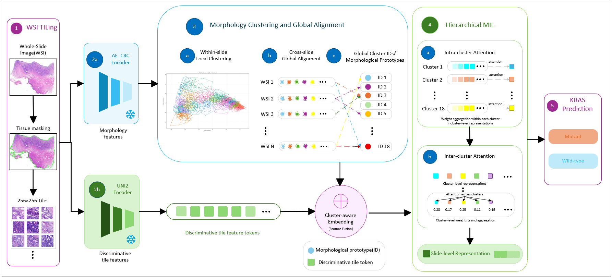

# TCAMIL

**TCAMIL (Two-stage Cluster-aware Aligned Multiple Instance Learning)** is a weakly supervised computational pathology framework for **KRAS mutation prediction** from colorectal cancer (CRC) H&E whole-slide images.

## Overview

TCAMIL is designed to model the histomorphological heterogeneity of colorectal cancer. Instead of directly aggregating patch features, it first constructs a **globally aligned morphology-aware phenotype space** through within-slide clustering and cross-slide alignment, and then performs **cluster-aware hierarchical MIL aggregation** for slide-level prediction.

<p align="center">
  
</p>

## Framework

The main workflow of TCAMIL includes:

1. **WSI tiling**: H&E whole-slide images are tessellated into non-overlapping image tiles.
2. **Dual feature extraction**: AE-CRC extracts morphology-oriented features for clustering, while UNI2 extracts discriminative tile-level features for prediction.
3. **Within-slide local clustering**: morphologically similar tiles within each WSI are grouped into local phenotype units.
4. **Cross-slide global alignment**: local cluster prototypes from different WSIs are aligned into a shared global morphology-aware phenotype vocabulary.
5. **Cluster-aware feature fusion**: globally aligned cluster identities are embedded and fused with tile-level discriminative features.
6. **Hierarchical MIL prediction**: intra-cluster attention aggregates tiles within each phenotype unit, and inter-cluster attention aggregates cluster-level representations for final KRAS mutation prediction.
7. **Interpretability analysis**: attention-dominant phenotypes and high-attention tissue regions are analysed to provide morphology-aware model interpretation.

## Dataset

This project uses two colorectal cancer cohorts:

- **Gansu cohort**: private cohort from Gansu Provincial People's Hospital, 349 patients.
- **SurGen cohort**: publicly available Scottish colorectal cancer cohort, 350 patients.

## Evaluation setting

- **Internal validation**: patient-level cross-validation within the Gansu cohort.
- **External validation**: model trained on the Gansu cohort and tested on the independent SurGen cohort without retraining or fine-tuning.


## Local Clustering

The within-slide local clustering step is implemented in `TCAMIL/DeepCluster-main`. The running script is:

```text
TCAMIL/DeepCluster-main/run_clustering.py
```

This script is used to configure the input patch directory, output directory, feature extractor, GPU setting, and saving options. The detailed feature processing and local clustering procedure is implemented in:

```text
TCAMIL/DeepCluster-main/Clustering.py
```

Before running local clustering, users need to modify the following parameters in `run_clustering.py` according to their own dataset:

```python
args.input_path = 'path/to/patches_x20'
args.output_path = 'path/to/local_clustering_output'
args.feature_ext = 'ae_crc'
args.gpu_ids = '0'
args.batch_size = 128
args.dim_reduce = 256
args.store_features = True
args.store_clusters = False
args.store_plots = False
```

Here, `args.input_path` indicates the folder containing WSI patch folders, `args.output_path` indicates the directory for saving local clustering outputs, and `args.feature_ext` specifies the feature extractor used for patch-level representation. The local clustering results generated in this step are used as the input for the subsequent global cluster alignment stage.
